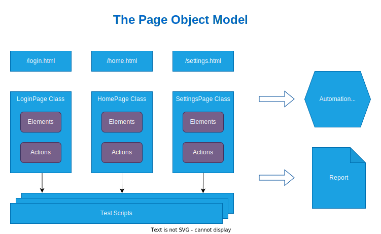
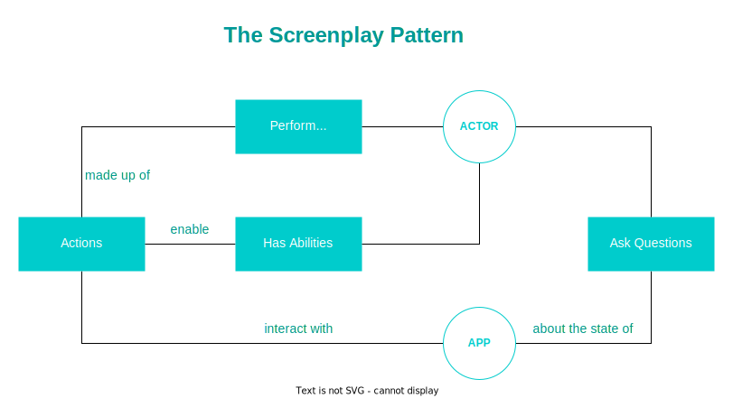

# Sloth Framework

欢迎使用 Sloth UI 自动化测试框架.

----

## 框架简介

Sloth 是一个基于 pytest 封装了 Appium Webdriver, 融合了 Page Object Model 和 Screenplay Pattern 两种 UI 用例设计模式, 简单易用且功能丰富的自动化测试框架.


## 主要功能

- 简洁且功能丰富的定位元素方法
- 无感知自动启动 Appium Server
- 自动获取可用的连接设备
- 支持多设备交互的测试场景
- TTS语音指令模块
- 实时采集CPU, 内存, 电池温度等性能数据
- 集成 Allure 报告

## 相关技术

- Pytest
- Page Object Model
- Screenplay Pattern

### Pytest

pytest 框架既可以用来编写小的单元测试, 又可以结合多种设计模式来应对功能更加复杂的应用程序测试.

例如, 编写一个单元测试, 首先定义一个待测函数

```python
def func(x):
    return x + 1
```

然后编写一条测试用例

```python
def test_answer():
    assert func(3) == 5
```

执行测试用例

```shell
$ pytest test_sample.py
=========================== test session starts ============================
platform linux -- Python 3.x.y, pytest-7.x.y, pluggy-1.x.y
rootdir: /home/sweet/project
collected 1 item

test_sample.py F                                                     [100%]

================================= FAILURES =================================
_______________________________ test_answer ________________________________

    def test_answer():
>       assert func(3) == 5
E       assert 4 == 5
E        +  where 4 = func(3)

test_sample.py:6: AssertionError
========================= short test summary info ==========================
FAILED test_sample.py::test_answer - assert 4 == 5
============================ 1 failed in 0.12s =============================
```

### Page Object Model

通过定义一些面向对象的类型, 来作为UI元素的仓库, 并且提供跟UI元素相关的操作, 来编写可读性好, 可复用且易于维护的测试用例.
通常用于 Selenium Web 应用自动化测试, 也适用于关键字驱动, 数据驱动或混合模式的框架中.



### Screenplay Pattern

以具备某些能力(Abilities)的用户(Actor)为中心, 通过在系统中进行某些活动(Tasks), 并询问系统状态(Questions), 从而达成某个目标(Goal).
能够按照业务的术语，借助易读的方法和对象API进行集成测试或验收测试.


