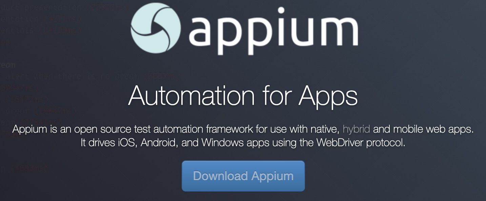
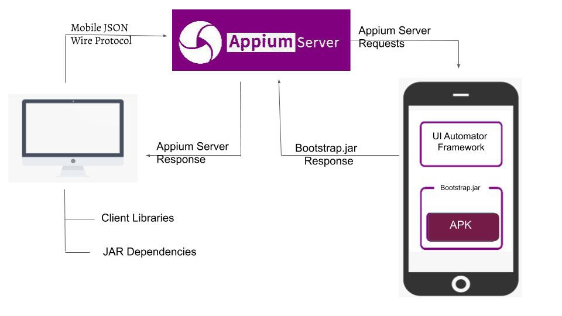
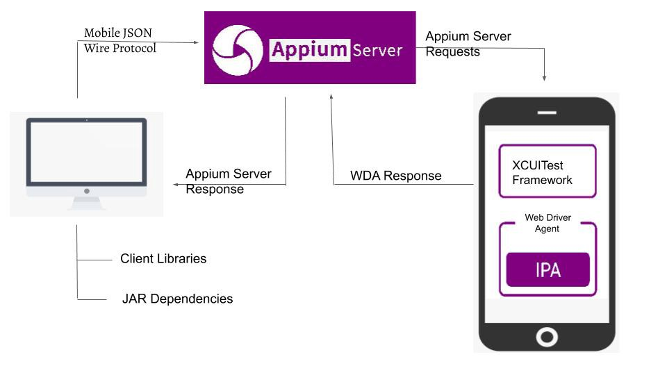
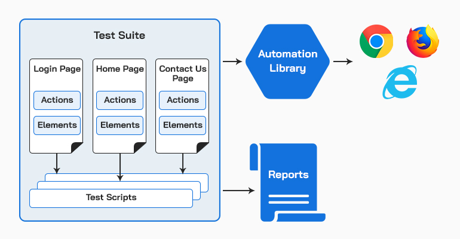
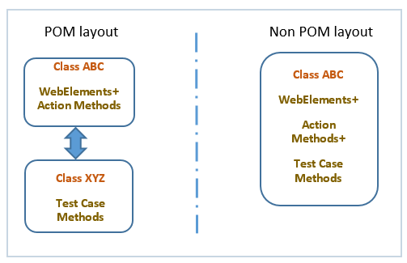

# Introduction

## 什么是 Appium

[][appium]

Appium 是一款开源的自动化测试框架, 可以对 Android 和 iOS 移动平台进行UI自动化测试.

## 为什么使用 Appium

- 开源, 社区热度
- 可同时支持 Android, iOS 和 Windows 平台
- 支持原生应用, Web浏览器, 混合应用
- 支持多种客户端编码语言: Python, Javascript, Java, C#, Ruby, PHP
- 底层扩展 Selenium Webdriver 命令
- 可运行发布版的App, 无需重新打包编译

## 工作原理

Appium 的核心是由 nodejs 编写的一个 http 服务, 提供丰富的 REST 接口.
客户端脚本按照 JSON Wire Protocol 与服务端通过 REST API 进行通信.
Appium 通过 Desired Capabilities 来实现兼容不同平台, 并启动运行App.

``` python
  capabilities = {
    "platformName": "Android",
    "platformVersion": "8",
    "deviceName": "Android Emulator",
    "app": "/path/to/the/downloaded/ApiDemos-debug.apk",
    "appPackage": "io.appium.android.apis",
    "appActivity": ".view.TextFields",
    "automationName": "UiAutomator2"
  }
```

## 如何与Android设备工作



## 如何与iOS设备工作



## Page Object Model





| POM Appium                       | Plain Appium               |
| -------------------------------- | -------------------------- |
| 按职责划分OOP类型                | 测试代码和元素定位混在一起 |
| 元素定位与业务逻辑分离           | 代码耦合度较高             |
| 无需重复定位元素, 代码结构更清晰 | 复杂度较高, 不易维护       |

## 代码演示

[appium]: https://appium.io/
