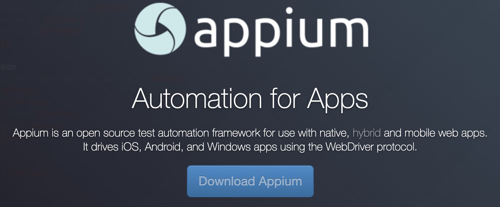
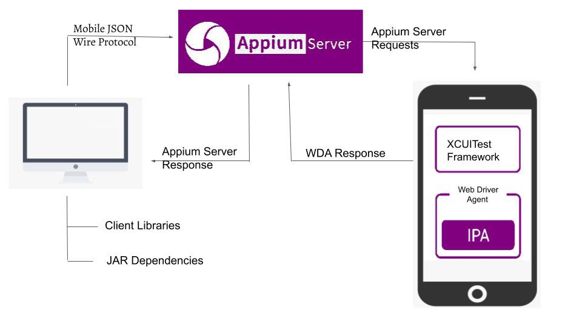
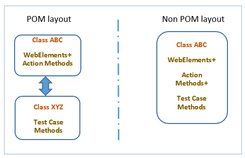

# Introduction

## 什么是 Appium

[][appium]

Appium 是一款开源的自动化测试框架, 可以对 Android 和 iOS 移动平台进行UI自动化测试.

## 为什么使用 Appium

- 开源, 社区热度
- 可同时支持 Android, iOS 和 Windows 平台
- 支持原生应用, Web浏览器, 混合应用
- 支持多种客户端编码语言: Python, Javascript, Java, C#, Ruby, PHP
- 底层扩展 Selenium Webdriver 命令
- 可运行发布版的App, 无需重新打包编译

## 工作原理

Appium 的核心是由 nodejs 编写的一个 http 服务, 提供丰富的 REST 接口.
客户端脚本按照 JSON Wire Protocol 与服务端通过 REST API 进行通信.
Appium 通过 Desired Capabilities 来实现兼容不同平台, 并启动运行App.

``` python
  capabilities = {
    "platformName": "Android",
    "platformVersion": "8",
    "deviceName": "Android Emulator",
    "app": "/path/to/the/downloaded/ApiDemos-debug.apk",
    "appPackage": "io.appium.android.apis",
    "appActivity": ".view.TextFields",
    "automationName": "UiAutomator2"
  }
```

## 如何与Android设备工作


## 如何与iOS设备工作



## Page Object Model




| POM Appium                       | Plain Appium               |
| -------------------------------- | -------------------------- |
| 按职责划分OOP类型                | 测试代码和元素定位混在一起 |
| 元素定位与业务逻辑分离           | 代码耦合度较高             |
| 无需重复定位元素, 代码结构更清晰 | 复杂度较高, 不易维护       |

## 代码演示

```python
import time

from appium import webdriver
from appium.webdriver.common.appiumby import AppiumBy
from selenium.webdriver.support import expected_conditions as ec
from selenium.webdriver.support.wait import WebDriverWait

from corelib.log import log

def test_login():
    serial = 'MGF6R20728000050'  # 手机序列号
    pkg_name = 'com.zuoyebang.iotunion'
    activity = 'com.zuoyebang.iot.union.ui.InitActivity'

    caps = {
        'platformName': 'Android',
        'automationName': 'Uiautomator2',
        'newCommandTimeout': 300,
        'udid': serial,
        'appPackage': pkg_name,
        'appActivity': activity,
        'noReset': True,
    }
    driver = webdriver.Remote(
        command_executor='http://127.0.0.1:4723/wd/hub', desired_capabilities=caps
    )
    driver.implicitly_wait(5)
    log.info('Launching app ...')
    time.sleep(5)

    # 登录页面 (验证页面标题: 登录发现更多精彩)
    locator = (AppiumBy.ID, 'com.zuoyebang.iotunion:id/tv_title')
    WebDriverWait(driver, timeout=5).until(ec.presence_of_element_located(locator))
    title = driver.find_element(*locator)
    expected_title = '登录发现更多精彩'
    assert title.text == expected_title
    log.info(f'校验标题为: {expected_title} 通过')

    # check 同意EULA
    agree = driver.find_element(
        by=AppiumBy.ID, value='com.zuoyebang.iotunion:id/cb_user_agreement'
    )
    time.sleep(1)
    checked = agree.get_attribute('checked')
    log.info(f'{checked=}')
    if checked == 'false':
        agree.click()

    # 输入手机号
    cell_phone = driver.find_element(
        by=AppiumBy.ID, value='com.zuoyebang.iotunion:id/et_phone'
    )
    cell_phone.set_text('13412345678')
    log.info('输入手机号: 13412345678')

    # 点击获取验证码
    send_code = driver.find_element(
        by=AppiumBy.ID, value='com.zuoyebang.iotunion:id/tv_send_verification_code'
    )
    send_code.click()
    log.info('点击 获取验证码')
    time.sleep(2)  # 页面过度时间

    # 输入验证码
    v_code = '1111'
    for i in range(4):
        code = driver.find_element(
            by=AppiumBy.ID, value=f'com.zuoyebang.iotunion:id/et_verification_code_{i}'
        )
        code.set_text(v_code[i])
    log.info(f'输入验证码: {v_code}')

    # 获取toast
    locator = (AppiumBy.XPATH, '//*[contains(@text,"登录成")]')  # 文本部分匹配
    toast = WebDriverWait(driver, timeout=5).until(lambda d: d.find_element(*locator))
    expected_toast = '登录成功'
    assert toast.text == expected_toast
    log.info('登录成功')

    log.info('观看手机画面5秒')
    time.sleep(5)
    driver.quit()  # 释放WebDriver
```

[appium]: https://appium.io/
